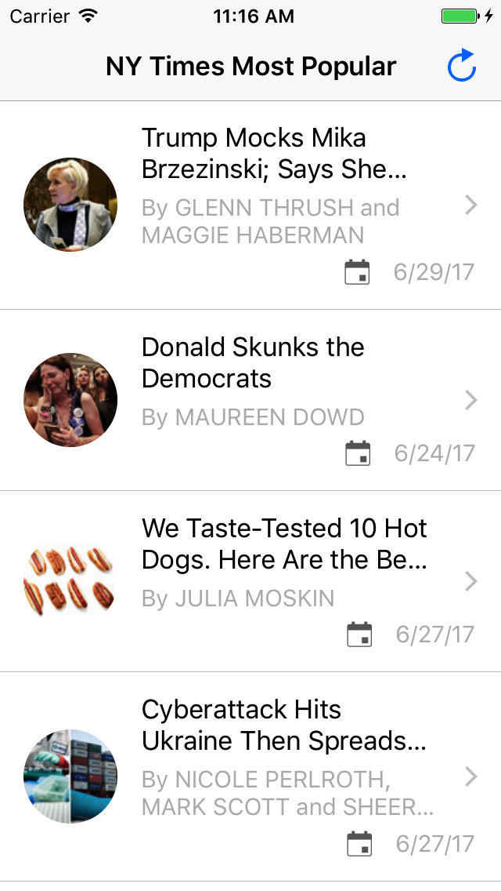

# NewYorkTimesDemoApp

This is a sample application about how to use New York Times Most Popular API. It lists the most viewed articles from the last 7 days. If you click on an article you can read it in a SafariViewController.

## How to use

1. Download the project or clone the repository.
2. Open the project with Xcode 8.
3. Open `NetworkConstants.swift` file and change the apikey constant to your NYT API key. 
(`static let apiKey = "YOUR_KEY_COMES_HERE"`)  
You can request for an API key on [NYT developer site](https://developer.nytimes.com/signup)  (you have to choose the `Most popular` API).
4. Run the project.

